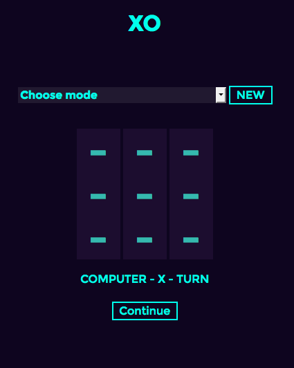
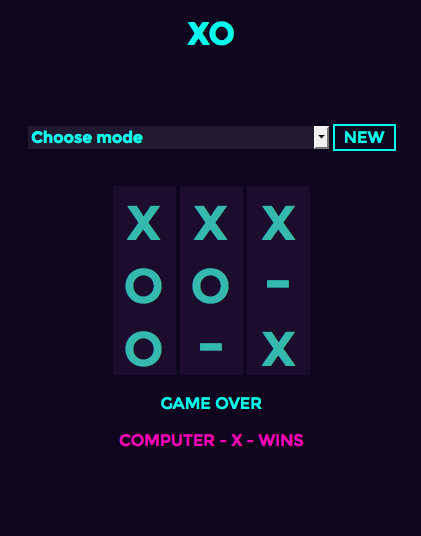

[](https://travis-ci.org/NULL-OPERATOR/XO) [](https://coveralls.io/github/NULL-OPERATOR/XO?branch=master) [](https://codeclimate.com/github/NULL-OPERATOR/XO)


# XO
view a live demo [**here**][here]

 


An *unbeatable Tic-Tac-Toe (Noughts and Crosses) program.


The user can choose the game type (human v. computer, human v. human, or computer v. computer), and which player goes first.


The computer player will never lose and wins whenever possible.  

**hopefully*

## User Stories
```
As a human,
So that I can perfect my tic-tac-toe skills,
I want to play against a really badass computer.

As a human,
So that I win vs Alaan,
I need to play against this human.

As a machine,
So that I can prove my superior power
I must always win

```

## To run
This app uses sinatra/ruby
You will need Ruby 2.2.3 installed

clone & cd into the repo
```
$ git clone https://github.com/NULL-OPERATOR/XO.git
```
install dependencies

```
$ bundle
```
to setup the server:
```
$ rackup
```
to view the page:
```
http://localhost:9292

```


## Approach

As this was new territory for me, I started by looking into the game itself, the strategies involved in winning and playing a perfect game. I started to branch into researching game theory/game trees/ai/etc and decided to just use the [**Strategy**][strategy] from wikipedia, and to build it up from there.

I used ruby, as I am currently more comfortable in it than anything else. I was confident I could have something up quickly that could be refactored, and iterated over, while figuring out how to design the ai. the logic/design of the ai isn't very elegant, but it works! haha.

*Update

the game now implements the [*minimax algorithm*][minimax], I began with the pseudocode, however it altered over the course of writing it in ruby, so it doesn't strictly follow the pseudocode, but works in a very similar way.


I played with adding a controlled depth, and aplha-beta pruning (extensions of minmiax that reduce the computation needed), but decided to stick with a naïve style.


Current Classes:
- **Node** - basic game functions, ie/ moves made/status/adding a move
- **AI**  - minimax implementation, using the node class to create a game tree
- **Game Factory** - setting up the game with the players & instantiated classes
- **Game** - adds player/ai moves, then making moves via node class

## Tests
are written in [**RSpec**][rspec], and [**Capybara**][capybara].

To run the tests: (this will run both feature and unit tests)
```
$ rspec
```
 [here]: https://xo-rj.herokuapp.com
 [minimax]: hhttps://en.wikipedia.org/wiki/Minimax
 [strategy]: https://en.wikipedia.org/wiki/Tic-tac-toe#Strategy
 [rspec]: http://rspec.info/
 [capybara]: https://github.com/jnicklas/capybara
